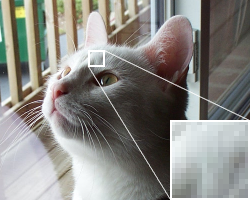

# CS1501 Project 5

## Goal:

To gain a better understanding of bitmap images, color quantization, and clustering algorithms through practical
implementation.

## Background:

A bitmap is an array of binary
data that represents the values of the pixels in an image. A full description of the .bmp file format can be found
at [bmp file format](https://en.wikipedia.org/wiki/BMP_file_format).

In this project, your program will be performing color quantization as defined
at [color_quantization](https://en.wikipedia.org/wiki/Color_quantization). In order to understand color quantization,
let us first consider the following two bitmap images seen in the previous link:

 

While image on the left ([source](https://commons.wikimedia.org/wiki/File:Dithering_example_undithered.png)) consisting
of 50,000 pixels (250 x 200) and the image on the
right ([source](https://en.wikipedia.org/wiki/File:Dithering_example_undithered_16color_palette.png)) consisting of
54,000 pixels (250 x 216) are visually similar, the number of colors used to represent
each image differs greatly. The original image, displayed on the left, uses a color palette for 24-bit RGB values (8
bits
red, 8 bits green, 8 bits blue) while the image on the right is displayed using a palette for only 16 colors which are
displayed along the bottom edge of the image.

As seen in the example above, color quantization reduces the number of distinct colors used in an image while attempting to keep
the *color reduced* image as visually similar to the original image as possible. Color quantization is often
useful when displaying images on devices that only support a limited number of colors and allows efficient lossy
compression for bmp images.

To perform color quantization, you will produce *color maps*. These data structures should map each distinct color in
a given input to the color from the reduced color palette it should be replaced with after quantization.

## High-level description:

Your program will read in a bitmap image (.bmp file) and perform color quantization on the image using two different
algorithms, `BASIC_BUCKETING` and `CLUSTERING`, while considering two different metrics, `SQUARED_EUCLIDEAN` and `COSINE_DISTANCE`,
which are described below in the Specifications.

## Specifications:

1. You will need to implement a class named `BucketingMapGenerator`
   in `./app/src/main/java/cs1501_p5/BucketingMapGenerator.java` which implements the
   interface `ColorMapGenerator_Inter`. This class will implement the method `computeColorMap` as shown
   in `ColorMapGenerator_Inter.java` in order to return a color map. The color is computed by taking the range of RGB values, treated as a single
   24-bit number, and
   dividing into equal-sized buckets. Your code should treat the Red value as the most significant 8-bits, the Green value 
   as the middle 8-bits, and the Blue value as the least significant 8-bits. For instance, if 256 colors are desired, then the first
   bucket contains [0, 65535], bucket two contains [65536, 131071], etc. and the center of each bucket should be used as
   the final color of that bucket (e.g., 32768, and 98304 for the buckets above).

1. You will need to implement two stateless classes (no attributes, only methods) which implement the interface `DistanceMetric_Inter`:
    * `SquaredEuclideanMetric` in `./app/src/main/java/cs1501_p5/SquaredEuclideanMetric.java`. This class will implement
      the `colorDistance` method as shown in `DistanceMetric_Inter.java` by returning the distance between the RGB
      values of two pixels using the squared
      Euclidean formula:

      `d(p1, p2) = (R1-R2)^2 + (G1-G2)^2 + (B1-B2)^2`
        * A full description of Squared Euclidean Distance can be found
          at [squared_euclidean](https://en.wikipedia.org/wiki/Euclidean_distance#Squared_Euclidean_distance).

    * `CosineDistanceMetric` in `./app/src/main/java/cs1501_p5/CosineDistanceMetric.java`. This class will implement
      the `colorDistance` method as shown in `DistanceMetric_Inter.java` by returning the distance between the RGB
      values of two pixels using the cosine
      distance formula:

      `c(p1, p2) = 1 - ((R1*R2)+(G1*G2)+(B1*B2)) / (sqrt(R1^2 + G1^2 + B1^2) * sqrt(R2^2 + G2^2 + B2^2))`
        * A full description of Cosine Distance can be found
          at [cosine_distance](https://en.wikipedia.org/wiki/Cosine_similarity#Cosine_Distance).

1. You will need to implement a class named `ClusteringMapGenerator`
   in `./app/src/main/java/cs1501_p5/ClusteringMapGenerator.java` which implements the
   interface `ColorMapGenerator_Inter`. This class should have a constructor that accepts a class that implements
   the `DistanceMetric_Inter` interface to be used when computing distances between two pixels. `ClusteringMapGenerator` will perform
   color quantization via a variation of K-Means clustering as specified below:

    1. `generateColorPalette(Pixel[][] pixelArr, int numColors);`
        * This method computes an initial color palette by utilizing a custom initialization procedure that we will call `K-Means--`
          that is described as follows:
            * Pick the first initial color as the first pixel in the .bmp image: (0, 0)
            * Select the remaining `numDistinctColors - 1` colors by choosing the pixel with the greatest computed distance. On
              ties, the pixel with the highest RGB value (when considered as a single 24-bit integer as described above) should be chosen.

    1. `generateColorMap(Pixel[][] pixelArr, Pixel[] initialColorPalette);`
		* This method should implement the naive K-Means clustering algorithm from lecture (Lloyd's algorithm).
		  `initialColorPalette` should be used as the starting k centroids.
		  This clustering should produce a final color palette and then return 
		  a map of original colors in `pixelArr` to values in the final color palette.

1. You will need to implement a class named `ColorQuantizer` in
   `./app/src/main/java/cs1501_p5/ColorQuantizer.java` which implements
   `ColorQuantizer_Inter`. This class should have two constructors. The first
   should accept a two-dimensional Pixel array which represents the pixels from
   the .bmp file and an instance of a class that implements the
   `ColorMapGenerator_Inter` interface which should be used to generate a
   color map. The second should accept the name of `.bmp` file to read and an
   instance of a class that implements the `ColorMapGenerator_Inter`
   interface which should be used to generate a color map.

## Submission Guidelines:

* **DO NOT** add `./app/build/` to your git repository.
    * Leave the `./app/build.gradle` file there, however

* Be sure to remember to push the latest copy of your code back to your GitHub
  repository before submitting. To submit, log into Gradescope from Canvas and have GradeScope pull your repository from
  GitHub.

## Additional Notes/Hints:

* You can use JCL classes to solve this project.

## Grading Rubric

| Feature                                                                                | Points 
|----------------------------------------------------------------------------------------|--------
| Squared Euclidean `colorDistance` works correctly                                      | 5
| Cosine Distance `colorDistance` works correctly                                        | 5
| `BucketingMapGenerator`'s `generateColorPalette` works correctly                       | 2
| `BucketingMapGenerator`'s `generateColorMap` works correctly                           | 5
| `ClusteringMapGenerator`'s `generateColorPalette` works correctly with Euclidean       | 10
| `ClusteringMapGenerator`'s `generateColorPalette` works correctly with Cosine Distance | 10
| `ClusteringMapGenerator`'s `generateColorMap` works correctly with Euclidean           | 10
| `ClusteringMapGenerator`'s `generateColorMap` works correctly with Cosine Distance     | 10
| `quantizeTo2DArray` works correctly with `BucketingMapGenerator`                       | 10
| `quantizeToBMP` works correctly with `BucketingMapGenerator`                           | 3
| `quantizeTo2DArray` works correctly with `ClusteringMapGenerator` and Eucliean         | 10
| `quantizeToBMP` works correctly with `ClusteringMapGenerator` and Euclidean            | 3
| `quantizeTo2DArray` works correctly with `ClusteringMapGenerator` and Cosine Distance  | 10
| `quantizeToBMP` works correctly with `ClusteringMapGenerator` and Cosine Distance      | 2
| Proper assignment submission                                                           | 5
